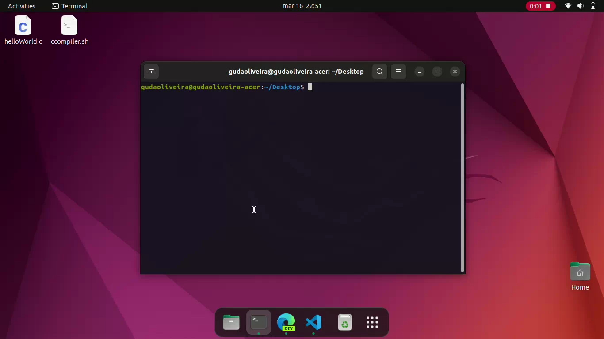

# Automatic GCC Compile and Run

## This is a shell script intended to be used along the GCC compiler in linux

Hi! This is my first shell project, and despite being very simple, i decided to post anyway to show my progress learning Linux and Shell scripting.

I'm studying C Programming right now, and typing more than to lines of code to compile and run my projects everytime was stressing me out. So i thought, what would a _Real Software Engineer_ would do in my place?

He would automate this process, of course!

### So, what does this script do?
* It takes two arguments
    * The first one is the name of your C script
    * The second one is the name of your output file
    * Ex: _(./ccompiler.sh **HelloWorld.c HelloWorld.out**)_
* If there is any error on the code it won't do anything besides showing the error, otherwise...
    * It creates a folder called "executables"
    * Enters the folder, executes the program and return to the input script folder

## SEE IT WORKING
[](https://www.youtube.com/watch?v=PG6wKooJChA)
_Click on the image, [Or here](https://www.youtube.com/watch?v=PG6wKooJChA) to watch the demonstration_

## HOW TO INSTALL
First off all make sure that you have the latest version of GCC installed, if not, open your terminal and type:

```
sudo apt update && sudo apt upgrade
```
Then simply install using the command
```
sudo apt install gcc
```
After installed, simply put the script in the same folder as the C script you want to compile an run it in the terminal with 2 arguments:
* The name of the script you want to compile
* The name of the output file 
```
./ccompiler.sh example.c example.out
```
## FOUND A BUG? WANT TO IMPROVE SOMENTHING?
This is a good piece of portifolio to me, but it could be a great piece of portifolio for us! So feel free to contribute in any way that you might think i would enhance this project

Made with :revolving_hearts: in :brazil: